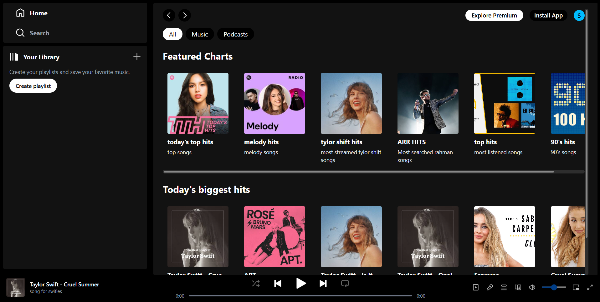
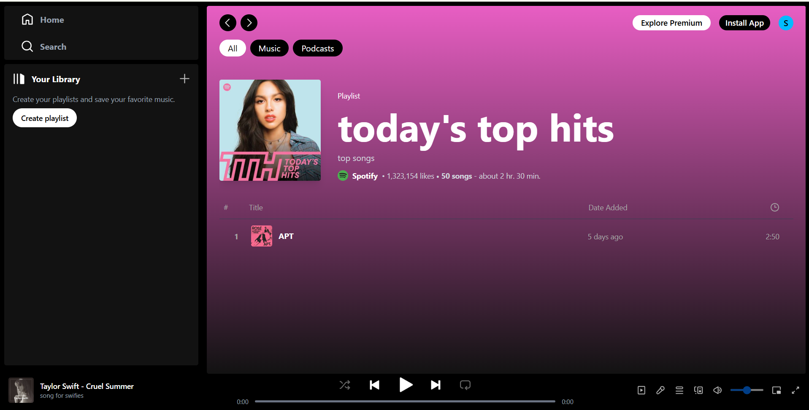
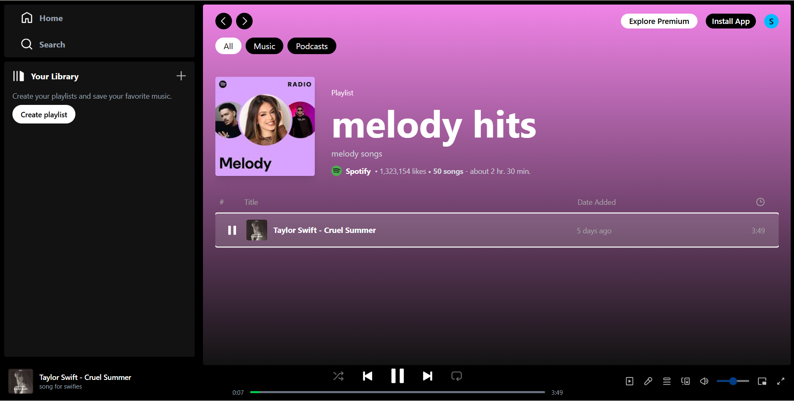
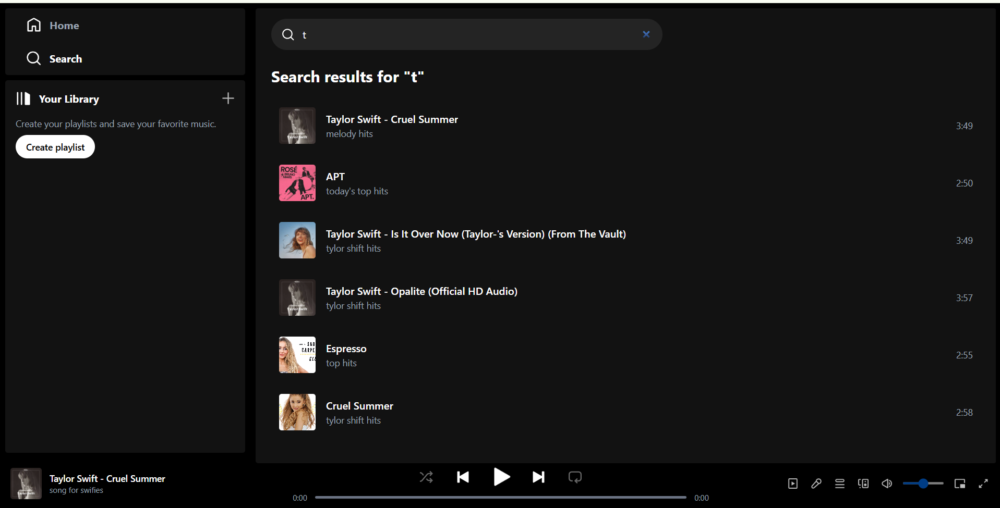
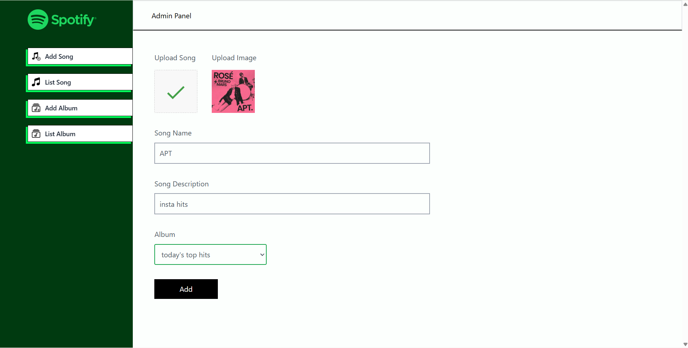
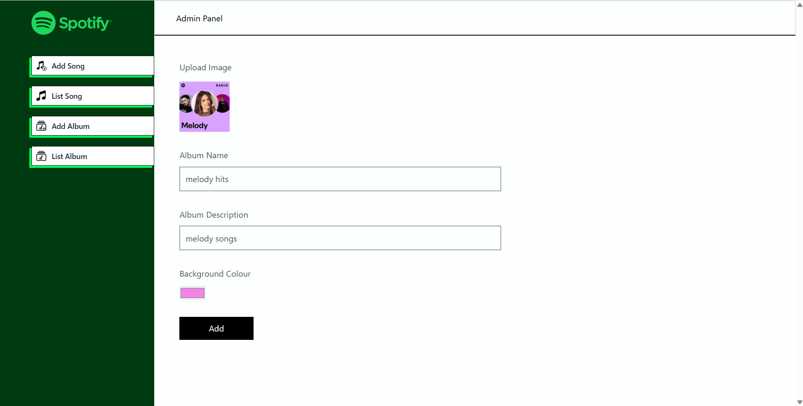
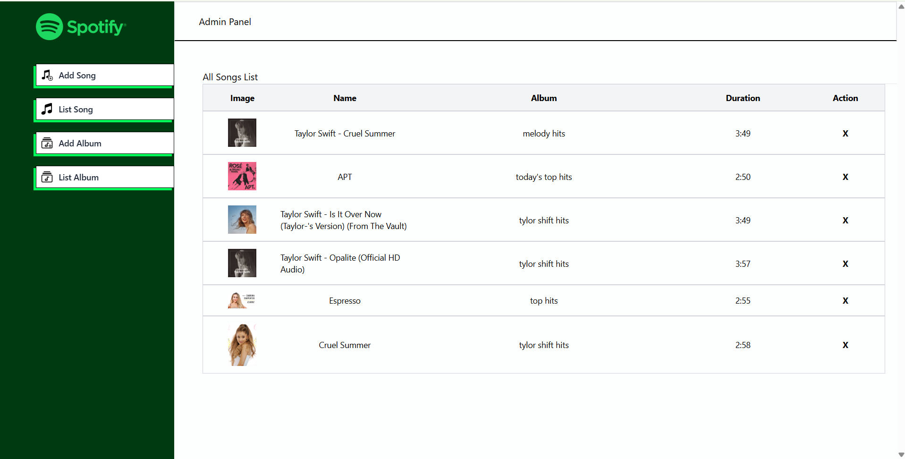
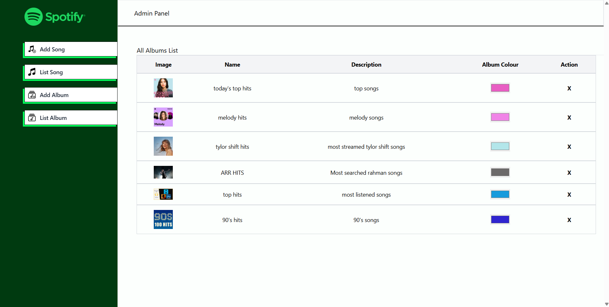

# Spotify Clone - MERN Stack

A full-stack Spotify-inspired music streaming application built with the MERN stack.  
The project includes a user-facing music player, album/playlist browsing, search, and a separate admin panel for managing songs and albums.

## Features

### User Application
- Spotify-inspired dark user interface
- Browse featured charts and music
- View albums and playlists
- Search songs
- Play and pause songs
- Previous/next track controls
- Progress bar and volume controls
- Responsive layout for different screen sizes
- Dynamic songs and albums loaded from the backend

### Admin Panel
- Add songs with audio and cover image
- Add albums with cover image and background colour
- View all songs
- View all albums
- Delete songs
- Delete albums
- Manage music content through the admin interface

## Tech Stack

### Frontend
- React.js
- Vite
- Tailwind CSS
- React Router
- Axios

### Admin Panel
- React.js
- Vite
- Tailwind CSS
- React Router
- Axios
- React Toastify

### Backend
- Node.js
- Express.js
- MongoDB
- Mongoose
- Cloudinary
- Multer
- CORS

### Deployment
- Vercel - Frontend and Admin Panel
- Render - Backend API
- MongoDB Atlas - Database
- Cloudinary - Image and audio storage

## Project Structure

```text
spotify-clone-mern/
├── spotify-frontend/
│   ├── src/
│   │   ├── api/
│   │   ├── assets/
│   │   ├── components/
│   │   └── context/
│   └── package.json
│
├── spotify-admin/
│   ├── src/
│   │   ├── api/
│   │   ├── assets/
│   │   ├── components/
│   │   └── pages/
│   └── package.json
│
├── spotify-backend/
│   ├── src/
│   │   ├── config/
│   │   ├── controllers/
│   │   ├── middleware/
│   │   ├── models/
│   │   └── routes/
│   ├── server.js
│   └── package.json
│
└── README.md
```

## Application Flow

```text
                    Spotify Clone
                         |
              +----------+----------+
              |                     |
        User Frontend           Admin Panel
              |                     |
       Browse / Search        Add / Manage Music
              |                     |
              +----------+----------+
                         |
                    REST API
                         |
                    Node + Express
                         |
                    MongoDB Atlas
                         |
                     Cloudinary
```

## Screenshots

### Home Page



### Album / Playlist View



### Music Player



### Search



### Admin - Add Song



### Admin - Add Album



### Admin - Song List



### Admin - Album List



## Live Demo

### User Frontend
https://spotify-clone-mern-psi.vercel.app

### Admin Panel
https://spotify-clone-mern-5ost.vercel.app

### Backend API
https://spotify-clone-mern-493i.onrender.com

## Local Setup

### 1. Clone the repository

```bash
git clone https://github.com/Srinivas5670/spotify-clone-mern.git
cd spotify-clone-mern
```

### 2. Backend

```bash
cd spotify-backend
npm install
npm start
```

The backend runs on:

```text
http://localhost:4000
```

Create a `.env` file in `spotify-backend` with your MongoDB and Cloudinary configuration.

### 3. User Frontend

Open another terminal:

```bash
cd spotify-frontend
npm install
npm run dev
```

### 4. Admin Panel

Open another terminal:

```bash
cd spotify-admin
npm install
npm run dev
```

## Environment Variables

### Backend

```env
MONGODB_URI=your_mongodb_connection_string
CLOUDINARY_NAME=your_cloudinary_cloud_name
CLOUDINARY_API_KEY=your_cloudinary_api_key
CLOUDINARY_SECRET_KEY=your_cloudinary_api_secret
FRONTEND_URL=http://localhost:5173
PORT=4000
```

### Frontend

```env
VITE_API_URL=http://localhost:4000
```

Do not commit `.env` files or API credentials to GitHub.

## API Routes

### Songs

| Method | Endpoint | Purpose |
|---|---|---|
| POST | `/api/song/add` | Add a song |
| GET | `/api/song/list` | Get all songs |
| DELETE | `/api/song/remove/:id` | Delete a song |

### Albums

| Method | Endpoint | Purpose |
|---|---|---|
| POST | `/api/album/add` | Add an album |
| GET | `/api/album/list` | Get all albums |
| DELETE | `/api/album/remove/:id` | Delete an album |

## Key Highlights

- Full-stack MERN architecture
- Separate user and admin applications
- REST API integration using Axios
- MongoDB database with Mongoose
- Cloudinary-based media storage
- Responsive Spotify-inspired UI
- Music playback using React context
- Admin content management
- Deployed frontend and backend

## Credits & Acknowledgements

This project was developed for learning and portfolio demonstration, with reference to existing Spotify Clone learning resources and tutorials.

Special thanks to:
- GreatStack YouTube Channel - tutorials and learning resources
- College seniors - guidance and support

## Original Reference

This project was developed with reference to an existing Spotify Clone project and modified/extended for learning and project demonstration.

Original repository:

https://github.com/nuricanbrdmr/Spotify-Clone-MERN-Website

## Author

**Srinivas Reddy**

## License

This project is intended for educational, portfolio, and demonstration purposes.
